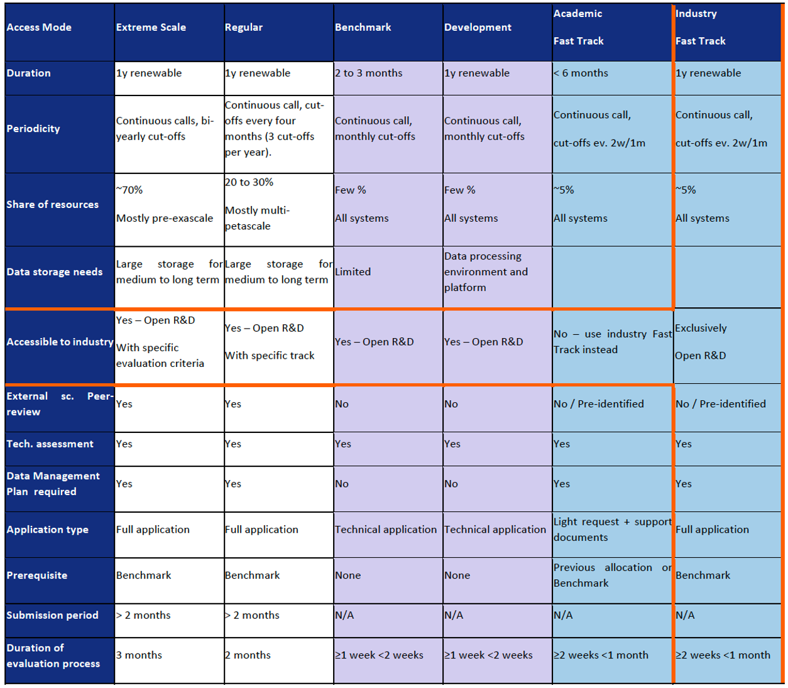

EuroHPC JU systems' access application procedures
=================================================

During this interactive tutorial we will:

#. Learn about different EuroHPC JU systems
#. Learn about the different types of access modes to these systems
#. Learn about the internal review and evaluation procedures of the submitted applications
#. Learn the tips and tricks on how to fill in the access call application forms 

.. prereq::

   The tutorial is intended for both applicants that have already had some experience with PRACE applications but most importantly for those who have never tried the European access call applications. However, we hope you already are acquainted with the consepts of `PRACE infrastructure <https://prace-ri.eu/>`_ and `EuroHPC JU <https://eurohpc-ju.europa.eu/>`_ from our yesterday's LUMI roadshow event.

About the tutorial
----------------

This material of this tutorial is developed by the `EuroCC National Competence Center
Sweden (ENCCS) <https://enccs.se/>`_ and taught in ENCCS workshops. 
Some images are based on material provided by PRACE AISBL and EuroHPC JU.

The material of the tutorial is licensed under `CC-BY-4.0
<https://creativecommons.org/licenses/by/4.0/>`_ and can be reused in any form
(with appropriate credit) in other courses and workshops.

.. csv-table::
   :widths: auto
   :delim: ;

   20 min ; :doc:`filename`

.. toctree::
   :maxdepth: 1
   :caption: The lesson

   introduction

.. toctree::
   :maxdepth: 1
   :caption: Reference

   quick-reference
   guide

.. _learner-personas:

Who is the course for?
----------------------

About the course
----------------

See also
--------

Credits
-------
