EuroHPC JU Systems
-------
The EuroHPC Joint Undertaking allows the EU and EuroHPC participating countries to coordinate their efforts and pool their resources with the objective of deploying in Europe world-class exascale supercomputers, able to perform more than one trillion (1.0e+18) operations per second and developing innovative supercomputing technologies and applications. See `EuroHPC JU page <https://eurohpc-ju.europa.eu/discover-eurohpc#ecl-inpage-211>`_

EuroHPC JU is developing a world-class supercomputing infrastructure by procuring and deploying by 2021 in the EU three pre-exascale supercomputers (capable of at least 1.0e+17 calculations per second) and five petascale supercomputers (capable of at least 1.0e+15 calculations per second). These new machines are being located across the European Union and will be available to Europe's private and public users, scientific and industrial users everywhere in Europe.
These are:

.. list-table:: **PRACE Useful links**
   :widths: 25 25
   :header-rows: 0
* - **LUMI**
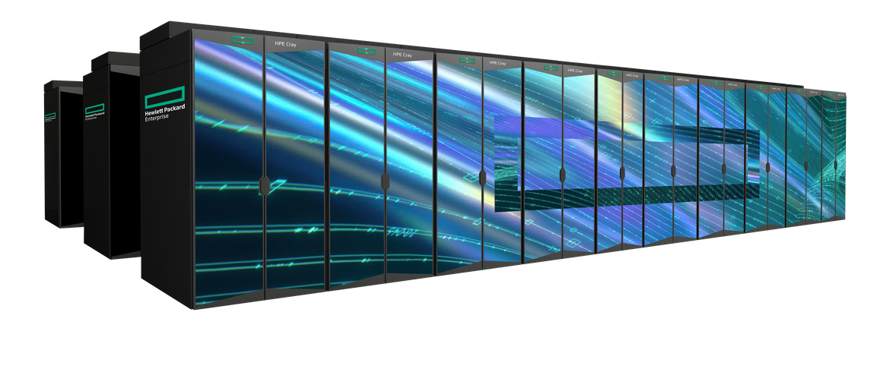
-  
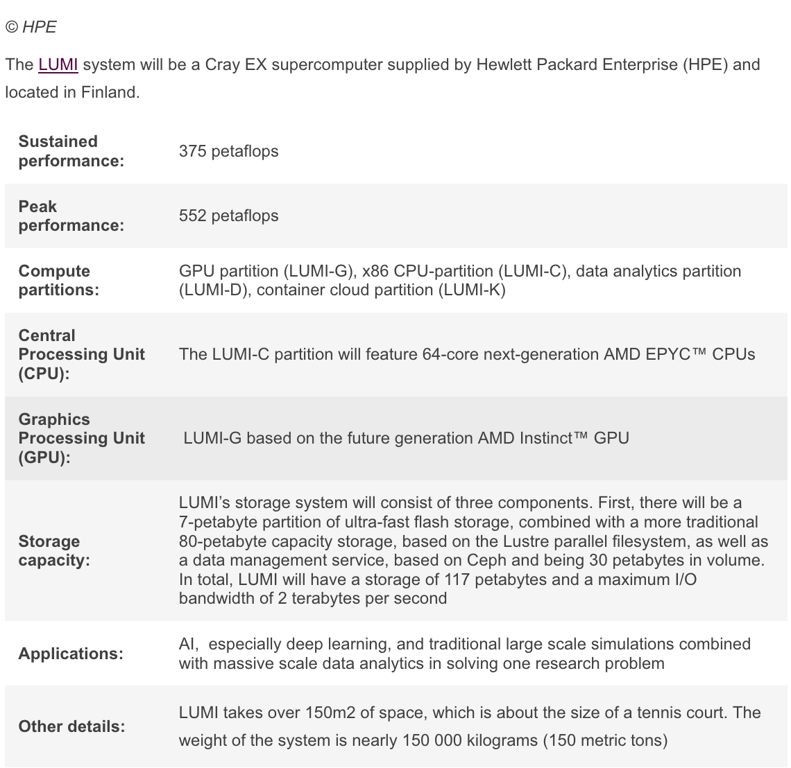

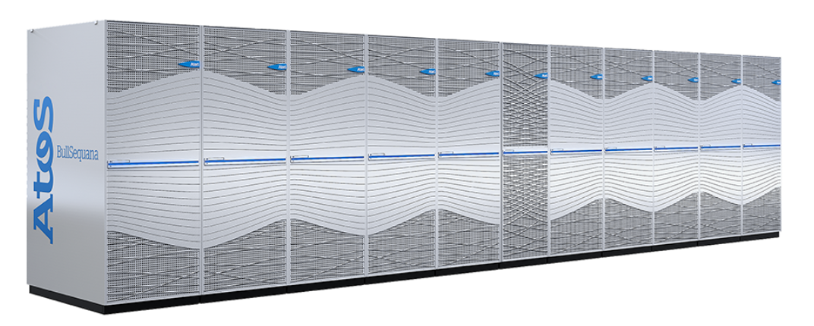
   
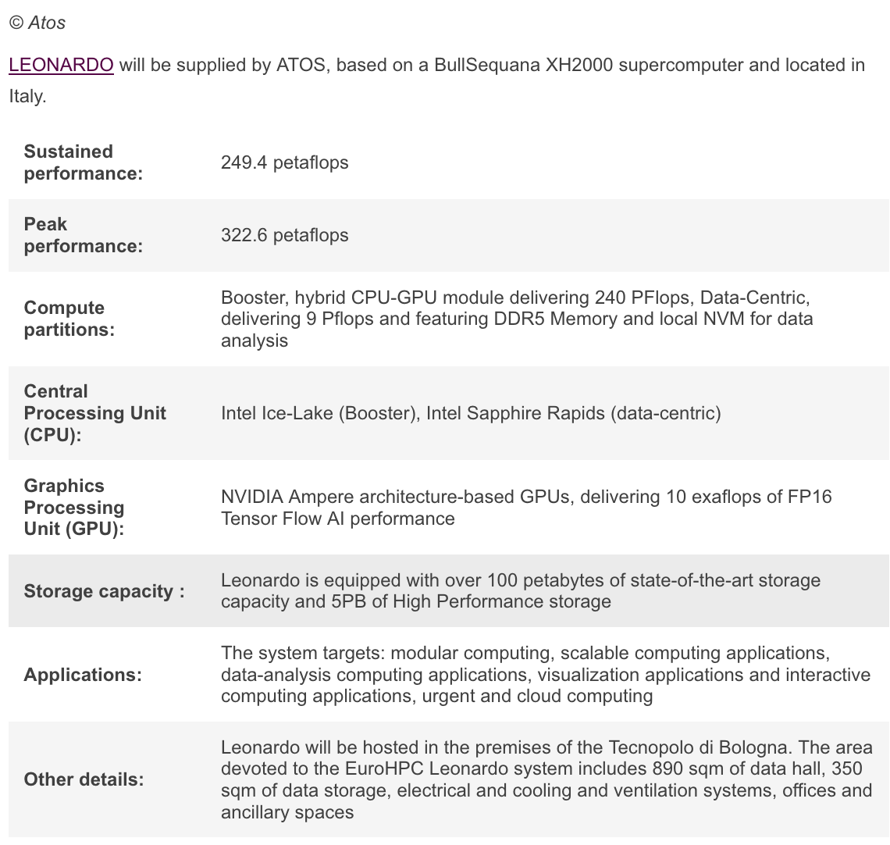

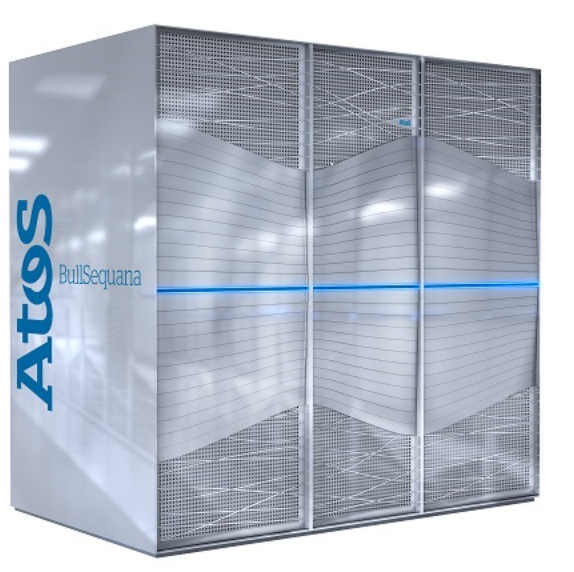
   
   
.. figure:: ../img/Vega_spec.png
   :scale: 30%
   :alt: **LUMI**
   :align: center

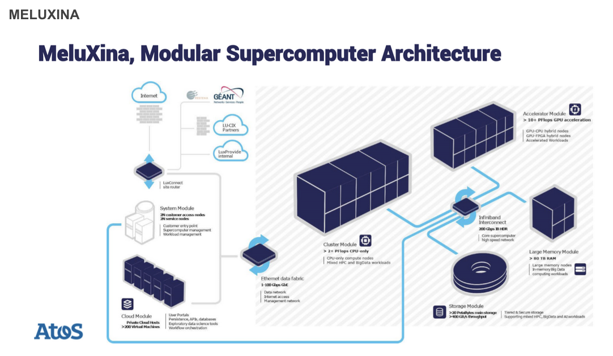
   
   
.. figure:: ../img/Meluxina_spec.png
   :scale: 30%
   :alt: **LUMI**
   :align: center
   
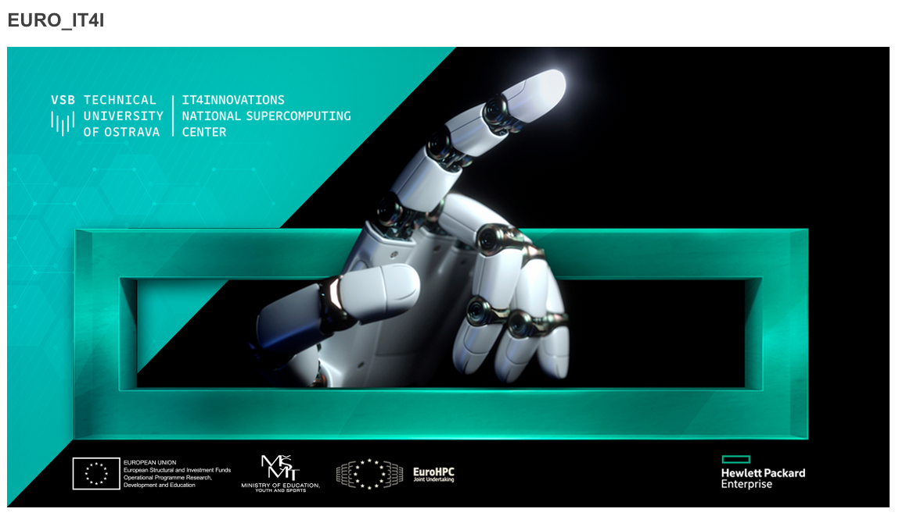
   
.. figure:: ../img/Karolina_spec.png
   :scale: 30%
   :alt: **LUMI**
   :align: center

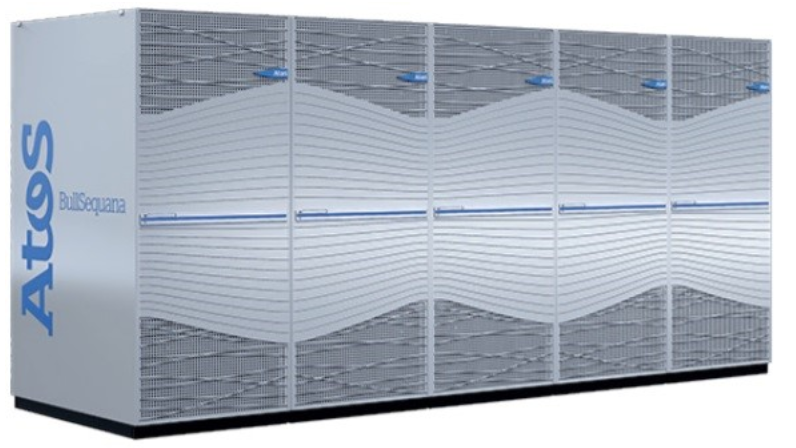
   
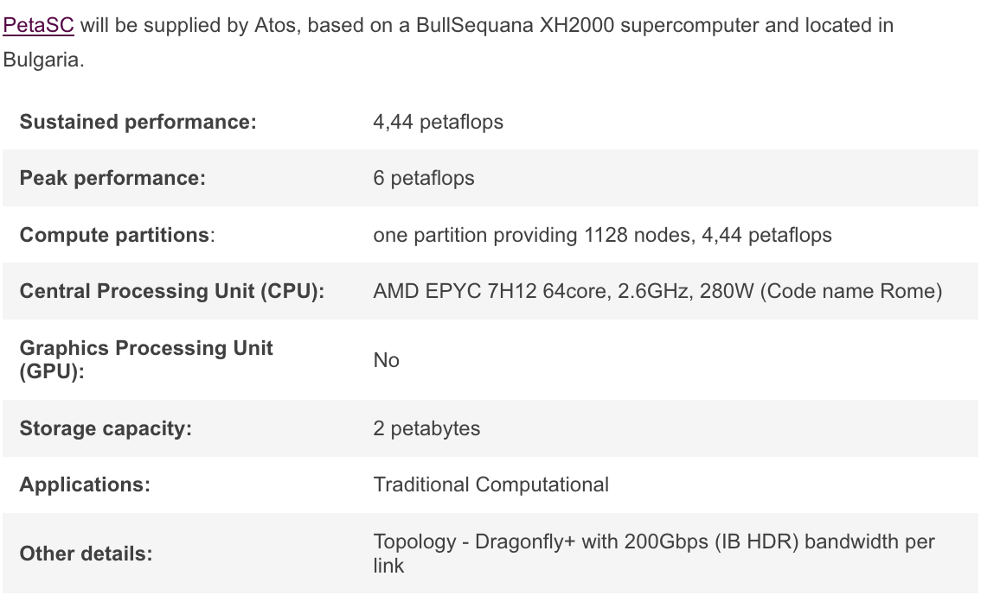

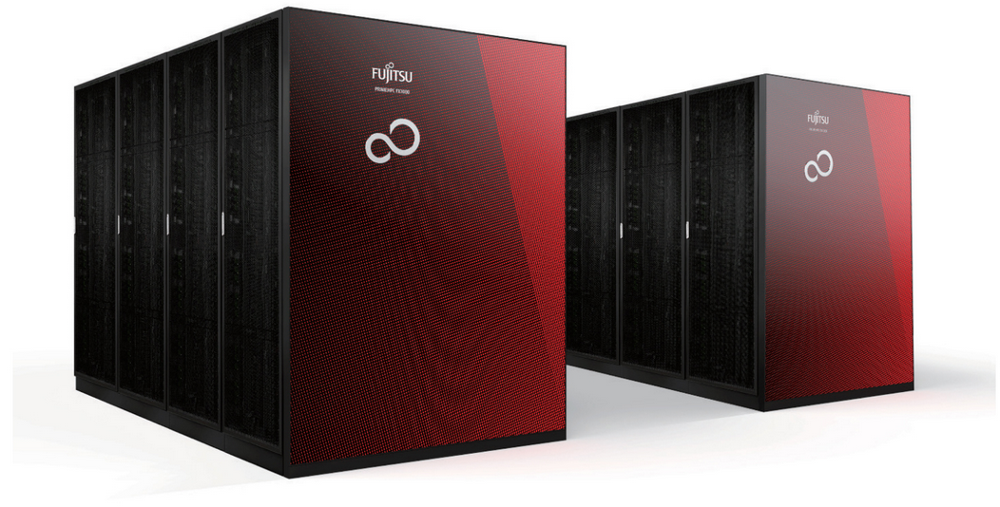
   
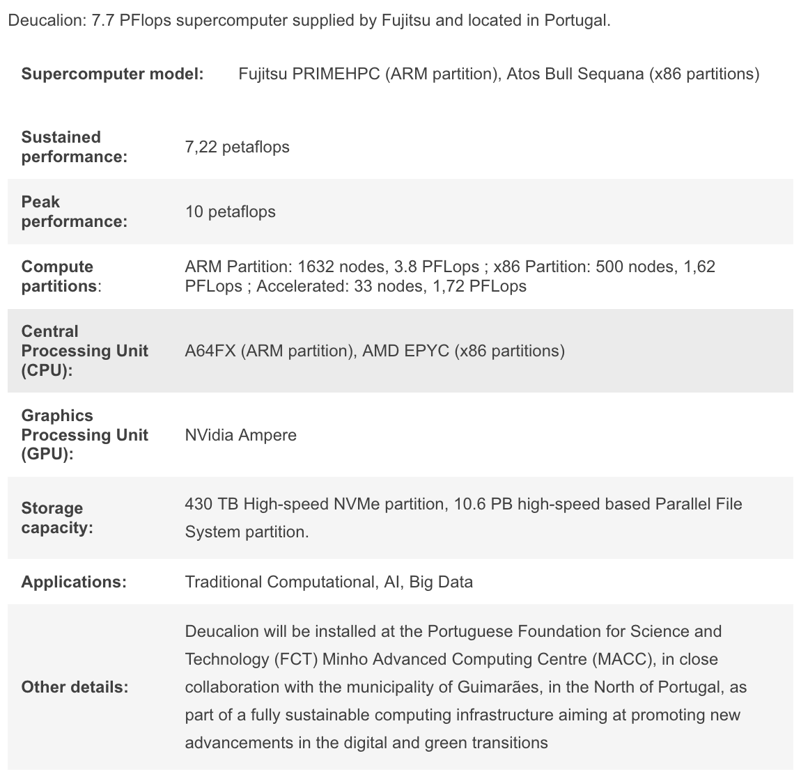
